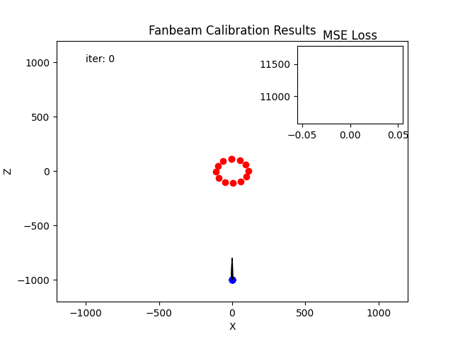
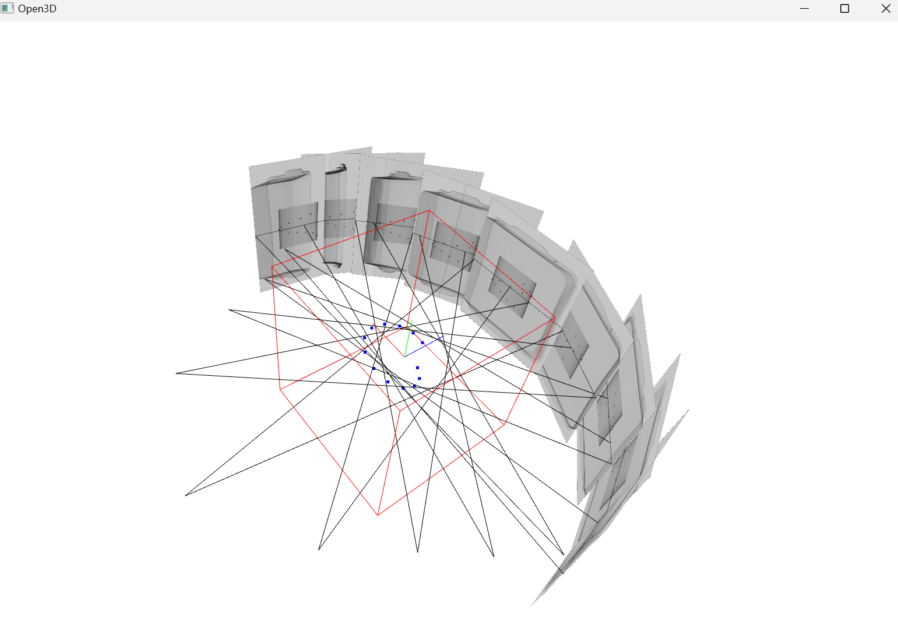
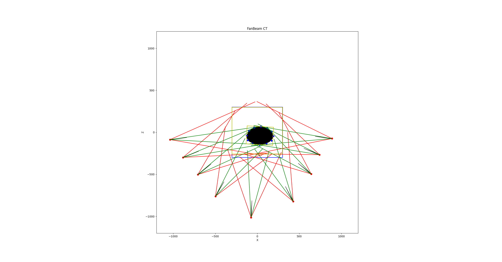
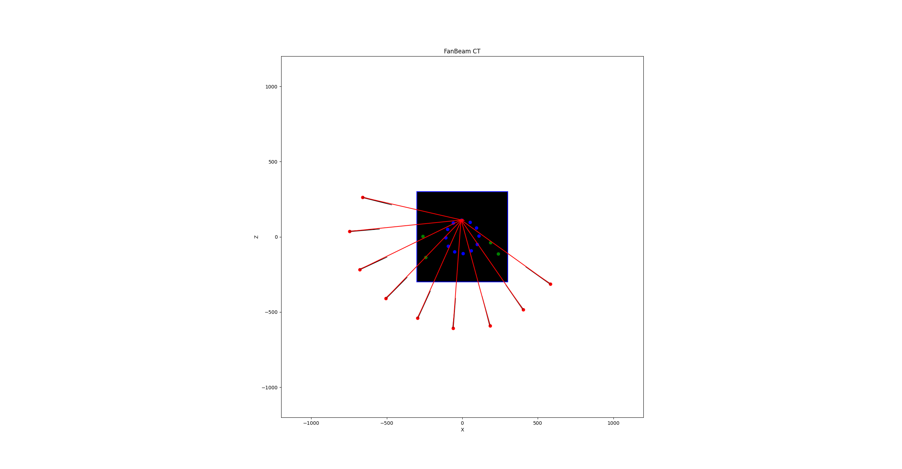

<p align="center">
  <h1 align="center">3D X-Ray Object bbox Detector </h1>
  <p align="center">
    
  </p>
  <p align="center">
    
    
    
    
  </p>
</p>

---

## Overview

This repository provides an end-to-end pipeline that **detects prohibited (threat) items in X-ray images** and **reconstructs their 3D bounding boxes** from multiple views.

> **Core idea**  
> Given multi-view X-ray scans, we run a 2D detector (YOLO) per view and fuse detections through a **visual-hull style** reconstruction to produce a consolidated **3D bounding box**.

---

## Table of Contents
- [Features](#features)
- [Environment Setup](#environment-setup)
- [Data & Checkpoints](#data--checkpoints)
- [Directory Layout](#directory-layout)
- [Quick Start](#quick-start)
- [Step-by-Step Pipeline](#step-by-step-pipeline)
  - [1) Voxel Conversion](#1-voxel-conversion-1_raw_to_npypy)
  - [2) 2D Object Detection](#2-2d-object-detection-2_detection_2dpy)
  - [3) 3D Bounding Box via Visual Hull](#3-3d-bounding-box-via-visual-hull-3_visual_hullpy)
- [Calibration](#calibration)
- [Sample Data](#sample-data)
- [Troubleshooting](#troubleshooting)
- [License & Acknowledgments](#license--acknowledgments)

---

## Features

- 🔎 **2D threat detection** with Ultralytics YOLO  
- 🧊 **X-ray volume (.raw) → NumPy/OBJ** conversion utilities  
- 📦 **3D bounding box reconstruction** from multi-view detections (visual-hull approach)  
- 🖥️ **Optional CUDA acceleration** (where supported)  
- 🧭 **Interactive 3D visualization** (Open3D) for inspection

---

## Environment Setup

> We recommend using a clean Conda environment.

```bash
conda create -n xray python==3.10
conda activate xray
pip install -r requirements.txt
```

**Required software:**
- Python ≥ 3.10
- OpenCV, NumPy
- Open3D
- Ultralytics YOLO
- CUDA-capable GPU & drivers (optional, for acceleration)

---

## Data & Checkpoints

Download the following resources **before** running the pipeline:

- **2D X-ray detector checkpoint (YOLO):**  
  Download and place in `data/ckpts/best.pt`  
  ↳ <https://drive.google.com/file/d/1crccaY23NZE9vU3WxRlw-blEJWBfkLwd/view?usp=sharing>

- **Raw voxel volumes (.raw):**  
  Place `.raw` files under `data/raw_voxel/`  
  ↳ <https://drive.google.com/drive/folders/1s-IQfyyOerdiZqSI2BXB3QthBzYwHSYp?usp=sharing>

---

## Directory Layout

Your project should resemble the following once data/checkpoints are in place:

```
.
├── data/
│   ├── bbox3d/               # 3D bounding box outputs
│   ├── calibration/          # Calibration results
│   ├── ckpts/                # Model checkpoints
│   │   └── best.pt
│   ├── inference_results/    # 2D detection results (images + JSON)
│   ├── raw_image/            # Raw X-ray images per ID
│   └── raw_voxel/            # Raw voxel volumes (.raw)
│       └── ..._L_512x512x619_8u.raw
├── 1_raw_to_npy.py           # Voxel converter (.raw → .npy/.obj)
├── 2_detection_2d.py         # 2D object detection
├── 3_visual_hull.py          # 3D bbox via visual hull
├── run.py                    # Full pipeline runner
└── run.sh                    # (Optional) helper script
```

---

## Quick Start

Run the **entire pipeline** for a given case **ID** (with optional visualization):

```bash
python run.py --id <ID> --vis
```

**Useful flags**
- `--raw_folder <path>`: folder containing `.raw` files (default: `data/raw_voxel`)
- `--list`: print available IDs and exit
- `--vis`: enable interactive 3D visualization

**Example**
```bash
python run.py --id 35671 --vis
```

---

## Step-by-Step Pipeline

### 1) Voxel Conversion (`1_raw_to_npy.py`)
Convert X-ray **raw voxel** volumes into NPY/OBJ formats.

```bash
python 1_raw_to_npy.py --id <ID> [--raw_folder <path>] [--list]
```

**Flags**
- `--id`: target case ID (required)
- `--raw_folder`: path to `.raw` volumes (default: `data/raw_voxel`)
- `--list`: list available raw IDs and exit

**Output**
- Converted assets are saved under: `data/raw_voxel/<ID>/`

---

### 2) 2D Object Detection (`2_detection_2d.py`)
Run YOLO on multi-view images to detect potential threats.

```bash
python 2_detection_2d.py --input data/raw_image/<ID> \
  [--conf-thres <float>] [--output-dir <path>] [--model <path>]
```

**Flags**
- `--input`: directory of images for the given `<ID>` (required)
- `--conf-thres`: confidence threshold (default: `0.1`)
- `--output-dir`: results directory (default: `data/inference_results`)
- `--model`: YOLO checkpoint path (default: `data/ckpts/best.pt`)

**Checkpoint**
- Download from: <https://drive.google.com/file/d/1crccaY23NZE9vU3WxRlw-blEJWBfkLwd/view?usp=sharing>  
  Save as: `data/ckpts/best.pt`

**Output**
- Per-image detections (JSON) + visualization images in `data/inference_results/`

---

### 3) 3D Bounding Box via Visual Hull (`3_visual_hull.py`)
Fuse 2D detections with voxel geometry to estimate **3D bounding boxes**.

```bash
python 3_visual_hull.py --name <ID> \
  [--calibration_path <path>] [--margin x y] \
  [--min_detection <int>] [--visualization <True|False>] \
  [--line_thickness <float>]
```

**Flags**
- `--name`: target case ID (required)
- `--calibration_path`: calibration results (default: `./data/calibration/calibration_results.npy`)
- `--margin`: fractional margins `[x y]` to pad the 3D box (default: `[0.1, 0.1]`)
- `--min_detection`: minimum number of views required (default: `4`)
- `--visualization`: enable 3D viewer (default: `False`)
- `--line_thickness`: visualization line width (default: `5.0`)

**Output**
- 3D bbox JSON saved under: `data/bbox3d/<ID>/`  
- Optional Open3D viewer when `--visualization True`

---

## Calibration

If camera calibration is required before reconstruction, see:

- **[docs/README_Calibration.md](docs/README_Calibration.md)**

Provide your calibration result to `--calibration_path` when running `3_visual_hull.py`.

---

## Sample Data

Use the following sample bundle to quickly try the pipeline:

- **Sample data**: <https://drive.google.com/drive/folders/1dfA5emcWmJ3lqxDM7yLRvWFF0AL54LfD>

---

## Troubleshooting

- **No detections or too few views**
  - Lower `--conf-thres` (e.g., `0.05`), ensure images are correctly placed under `data/raw_image/<ID>/`.
  - Confirm the YOLO checkpoint path (`--model`) is valid.

- **3D bbox is missing or degenerate**
  - Check `--min_detection` (needs enough views).
  - Verify calibration file and ID consistency.
  - Increase `--margin` slightly to avoid over-tight clipping.

- **Slow or CPU-bound**
  - Install CUDA-enabled PyTorch and make sure your drivers are up to date.
  - Ensure Open3D is installed with GPU support only if needed (CPU is fine for most cases).

- **Paths & permissions**
  - Make sure the repository has read/write access to `data/*` folders.

---

## License & Acknowledgments

- Please add your project’s **license** here (e.g., MIT, Apache-2.0).
- This work uses **Ultralytics YOLO** and **Open3D**; please respect their respective licenses.

---




## Open3d viewer

    python viewer_o3d.py



## Box fitting 

    python fit_bbox.py




## Triangulation 

    python triangulation.py



## VisualHull RANSAC

    python ransac_visualhull.py


