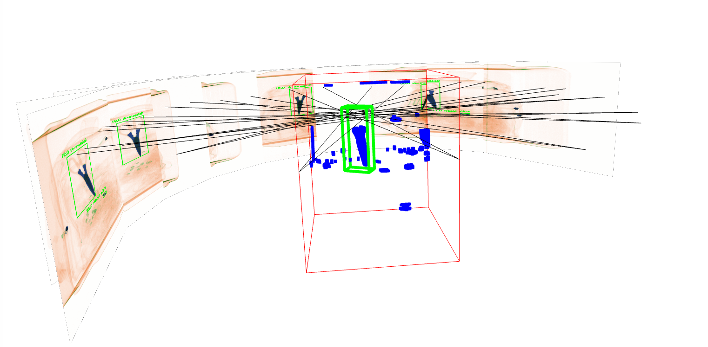

<p align="center">
  <h1 align="center">3차원 X-ray 위해물질 탐지기 </h1>
  <p align="center">
    <a href="https://www.secern.ai/"><strong>SECERN AI</strong></a>
  </p>
  <div align="center">
    
  </div>
  <p align="center">
    <a href='https://github.com/CUBOX-Co-Ltd/molit_xray_3d'>
      </a>
  </p>
</p>

## 개요
이 시스템은 X-Ray 이미지에서 위해물품을 감지하고 3D 좌표로 복원하는 통합 파이프라인입니다. 다중 시점의 X-Ray 이미지를 분석하여 위해물품의 3D 바운딩 박스를 생성합니다.


## 환경 설정
- Python 
- OpenCV
- NumPy
- Open3D
- Ultralytics YOLO
- CUDA 지원 환경 (선택사항, GPU 가속 시 필요)

### 가상환경 설치하기
환경 설치를 위하여 아나콘다 가상환경을 만든 후 (권장), requirements 설치 진행
```bash
conda create -n xray python==3.10
conda activate xray
pip install -r requirements.txt
```

### 데이터 다운로드 받기 

아래 링크로 2D Xray Detector 체크포인트를 다운받아서 `data/ckpts/` 에 저장 
```bash
https://drive.google.com/file/d/1crccaY23NZE9vU3WxRlw-blEJWBfkLwd/view?usp=sharing
```

아래 링크에서 .raw 데이터를 다운로드 받아,  `data/raw_voxel` 에 .raw 파일들을 저장 
```bash
https://drive.google.com/drive/folders/1s-IQfyyOerdiZqSI2BXB3QthBzYwHSYp?usp=sharing
```

## 디렉토리 구조 

모든 파일들이 올바른 위치에 넣었다면 이런 구조를 가져야됨.

```
.
├── data/
│   ├── bbox3d/             # 3D 바운딩 박스 결과 저장 디렉토리
│   ├── calibration/        # 캘리브레이션 파일 디렉토리
│   ├── ckpts/              # 모델 체크포인트 디렉토리
    │    ├──best.pt
│   ├── inference_results/  # 2D 검출 결과 저장 디렉토리
│   ├── raw_image/          # X-Ray 원본 이미지 디렉토리
│   └── raw_voxel/          # 복셀 데이터 디렉토리
│       │──..._L_512x512x619_8u.raw
├── 1_raw_to_npy.py         # 복셀 데이터 변환 스크립트
├── 2_detection_2d.py       # 2D 객체 검출 스크립트
├── 3_visual_hull.py        # 3D 바운딩 박스 생성 스크립트
└── run.sh                  # 실행 스크립트
```

## 사용하기 


### 캘리브레이션
시스템 사용 전 캘리브레이션이 필요한 경우 [Calibration](docs/README_Calibration.md) 를 참조하세요.


### 간편 실행 방법
제공된 run.py 스크립트를 사용하여 전체 파이프라인을 한 번에 실행할 수 있습니다:

```
python run.py --id <ID>
```

플래그:

```
--raw_folder <경로>: raw 파일이 저장된 폴더 경로 지정 (기본값: data/raw_voxel)
--list: 사용 가능한 raw 파일 목록 출력 후 종료
--vis: 3D 시각화 활성화

```

예시:

```
python run.py --id 35671 --vis
```


### 단계별 사용 방법


#### 1. 복셀 데이터 변환 (1_raw_to_npy.py)
복셀 데이터를 NPY 및 OBJ 형식으로 변환합니다.

```
python 1_raw_to_npy.py --id <ID> [--raw_folder <경로>]
```

플래그:

```
--id: 처리할 ID (필수)
--raw_folder: raw 파일이 저장된 폴더 경로 (기본값: data/raw_voxel)
--list: 사용 가능한 raw 파일 목록 출력
```

처리 과정:

지정된 ID에 해당하는 raw 파일 검색
복셀 데이터를 NPY 및 OBJ 형식으로 변환
결과 파일은 data/raw_voxel/<ID>/ 디렉토리에 저장


#### 2. 2D 객체 검출 (2_detection_2d.py)
X-Ray 이미지에서 위해물품을 감지합니다.
python 2_detection_2d.py --input data/raw_image/<ID> [--conf-thres <값>] [--output-dir <경로>]
플래그:

```
--input: 이미지가 저장된 폴더 경로 (필수)
--conf-thres: 검출 신뢰도 임계값 (기본값: 0.1)
--output-dir: 결과 저장 디렉토리 (기본값: data/inference_results)
--model: 사용할 YOLO 모델 경로 (기본값: data/ckpts/best.pt)
```

학습된 모델 다운로드:

```
https://drive.google.com/file/d/1crccaY23NZE9vU3WxRlw-blEJWBfkLwd/view?usp=sharing
```

다운로드한 모델은 "data/ckpts/best.pt"에 저장하세요.

처리 과정:

입력 폴더의 모든 이미지 파일 처리
각 이미지에서 위해물품 감지
결과는 JSON 파일 및 시각화된 이미지로 저장

#### 3. 3D 바운딩 박스 생성 (3_visual_hull.py)
2D 검출 결과와 복셀 데이터를 기반으로 3D 바운딩 박스를 생성합니다.

```
python 3_visual_hull.py --name <ID> [--visualization <True/False>]
```
플래그:

```
--name: 처리할 ID (필수)
--calibration_path: 캘리브레이션 결과 파일 경로 (기본값: ./data/calibration/calibration_results.npy)
--margin: 3D 바운딩 박스 여백 비율 [x마진, y마진] (기본값: [0.1, 0.1])
--min_detection: 3D 바운딩 박스 생성에 필요한 최소 2D 검출 수 (기본값: 4)
--visualization: 시각화 활성화 여부 (기본값: "False")
--line_thickness: 시각화 시 선 두께 (기본값: 5.0)
```

처리 과정:

복셀 데이터와 2D 검출 결과 로드
시각적 헐(Visual Hull) 알고리즘을 사용하여 3D 바운딩 박스 생성
결과는 JSON 파일로 data/bbox3d/<ID>/ 디렉토리에 저장
시각화 활성화 시 3D 객체 뷰어 제공

## 샘플 데이터

샘플 데이터는 다음 링크에서 다운로드할 수 있습니다:

```
https://drive.google.com/drive/folders/1dfA5emcWmJ3lqxDM7yLRvWFF0AL54LfD
```

[참고 문서](docs/X-ray%20모델_참고용.pdf)


추가 정보는 다음 문서를 참조하세요:

```
https://docs.google.com/presentation/d/1eHhKQvmNYAsJp0eLN6RImlfypTjJJO4D/edit#slide=id.p4
```
