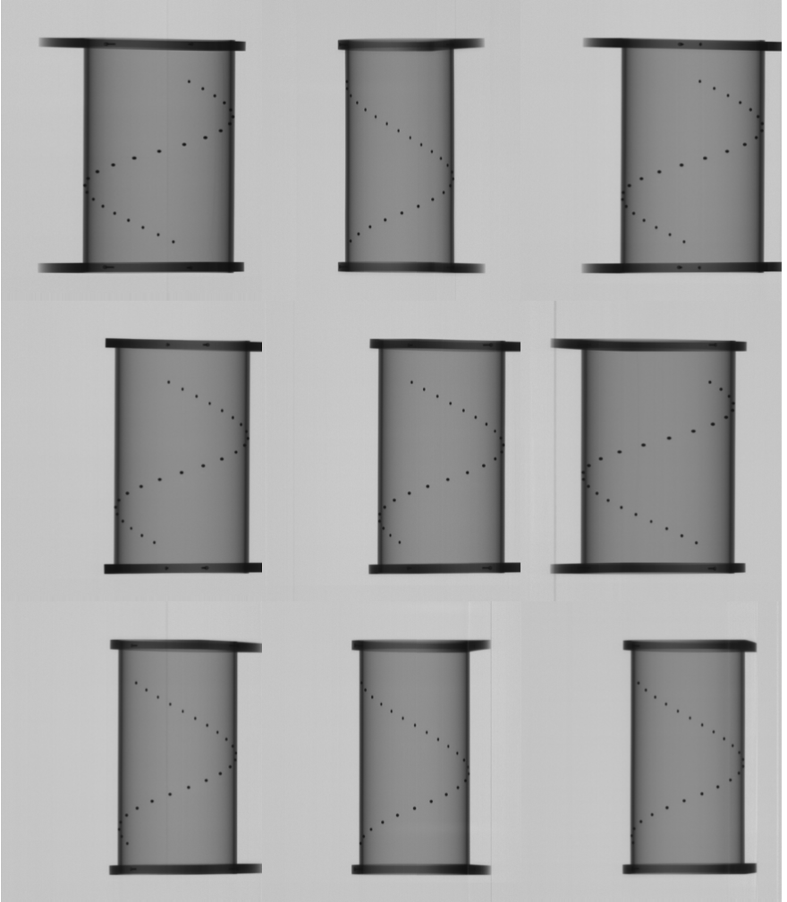
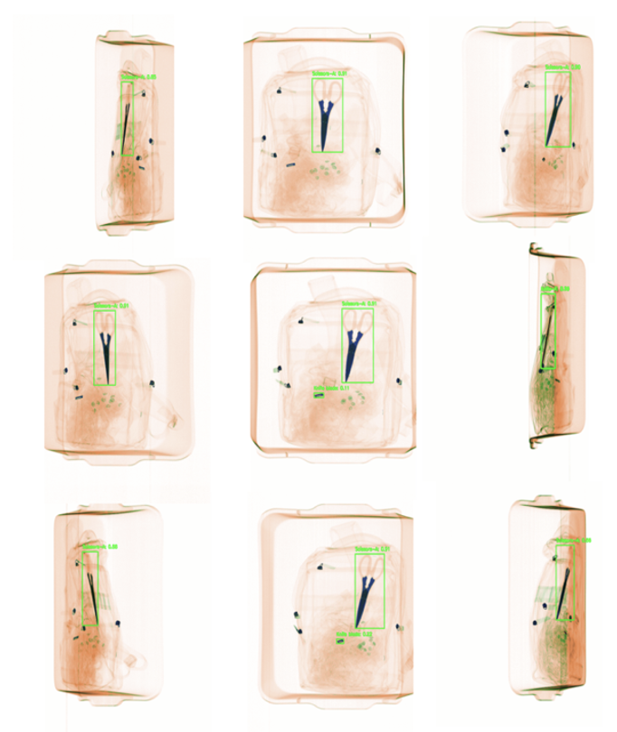
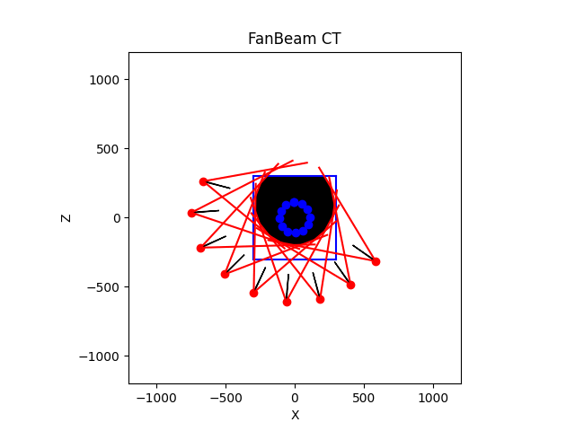
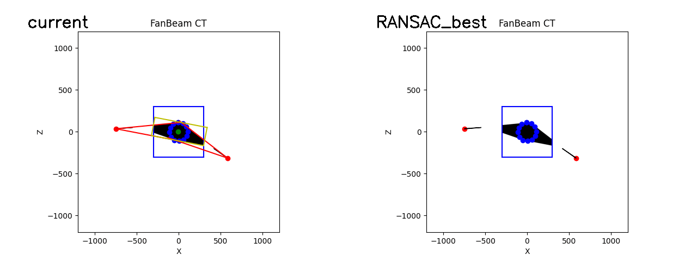
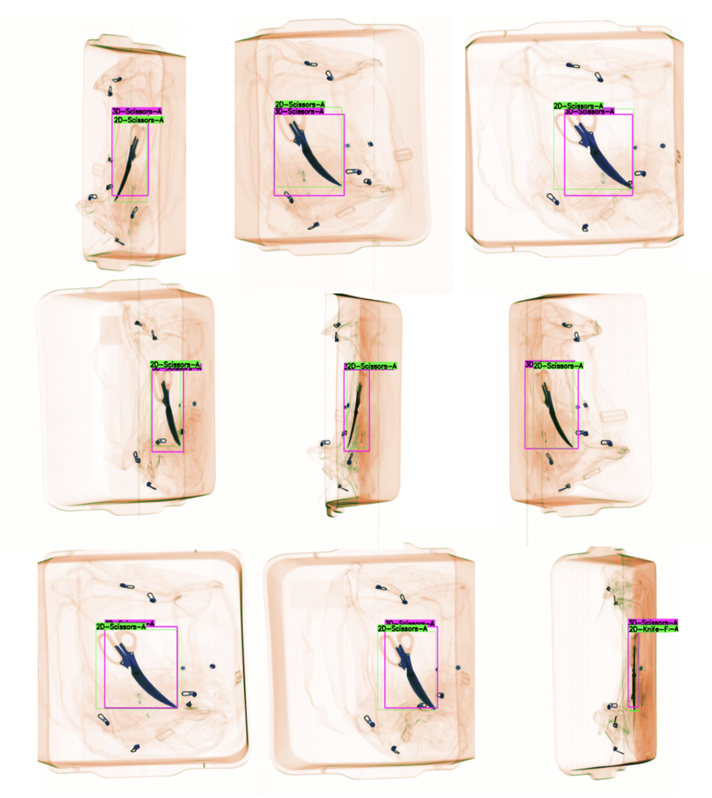
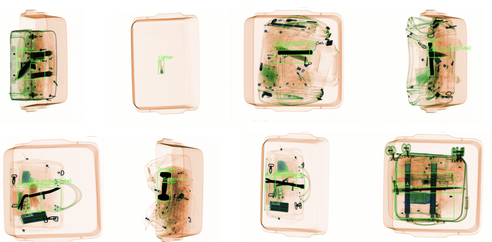
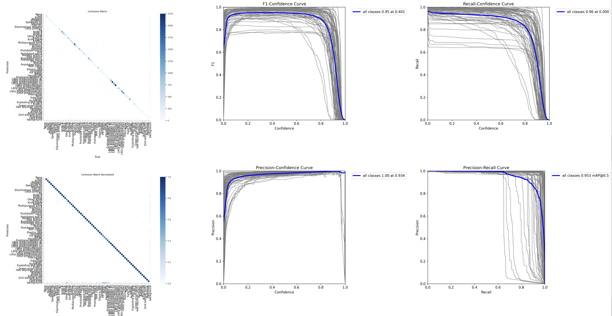

# Multiview X‑Ray 3D Hazardous Object Detection

<p align="center">
  
</p>

Robust end‑to‑end pipeline for reconstructing **3D bounding boxes of hazardous objects from multiview X‑ray images**. The system couples a high‑recall YOLO‑based 2D detector with a **visual‑hull** intersection and a **fan‑beam camera geometry** that treats **X as perspective** and **Y as independent**, enabling stable height reasoning and efficient 3D recovery even when views are cluttered or partially occluded.

---

## 🌟 News
- **2025‑09‑04** — [Technical Report](report.pdf) and full code is released.
- **2024‑12‑30** — Released 2D training & standalone inference under `detector2d/`.

---

## 🔍 Highlights
- **Four‑stage pipeline:** (1) 2D detection → (2) visual‑hull voxel constraints → (3) consistency filtering across views → (4) 3D bounding box recovery.
- **Fan‑beam with orthographic‑Y:** keep perspective in **X** while approximating **Y** as orthographic, simplifying reprojection and height estimation.
- **Works with ≥2 views** (typical: 9 views) and requires prior calibration.
- **Evaluation** via 3D→2D reprojection and IoU vs. detected 2D boxes.
- Modular design: training code for the detector is isolated under `detector2d/`, while the pipeline entry points remain at the repo root.

---

## 🗂 Repository Structure

```text
.
├─ calibration.py          # Fan‑beam calibration from beads → npy params
├─ detector.py             # Pipeline 2D inference → JSON + overlays
├─ visual_hull.py          # Visual‑hull + 3D bbox recovery + optional viewer
├─ eval.py                 # Reprojects 3D → 2D and reports IoU stats
├─ run.py                  # Convenience runner: detection → visual hull
├─ vh_utils/               # Visual‑hull utilities (IO, geometry, hull ops, viz)
│  ├─ __init__.py
│  ├─ io.py
│  ├─ geometry.py
│  ├─ hull.py
│  └─ viz.py
├─ detector2d/             # 2D training/eval/standalone inference (Ultralytics)
│  ├─ train.py
│  ├─ eval.py
│  ├─ inference.py
│  └─ configs/config.yaml
├─ models/
│  ├─ best.pt              # Inference checkpoint used by pipeline detector
│  └─ yolo11x.pt           # Optional pretrain for training
├─ data/
│  ├─ calibration/
│  │  ├─ calibration_results.npy
│  │  └─ 0/{2d.npy,3d.npy}
│  ├─ image/0/0.png        # Raw multiview images per case ID
│  ├─ voxel/0/0_512x512x619.npy
│  ├─ bbox2d/              # detector.py outputs JSON + overlays
│  ├─ bbox3d/              # visual_hull.py outputs 3D boxes (per class)
│  └─ eval_results/        # eval.py reports
├─ assets/                 # README images (teaser, dataset, eval)
└─ requirements.txt
```

---

## ⚙️ Installation

```bash
# (Optional) Create a clean env
conda create -n xray3d python=3.10 -y
conda activate xray3d

# Install deps
pip install -r requirements.txt
```

`requirements.txt` includes: `numpy`, `opencv-python`, `open3d`, `ultralytics`, `torch`, `torchvision`, `gdown`.

---

## 📦 Data Layouts

### Multiview 3D pipeline (per case ID)

```
data/
  calibration/
    calibration_results.npy
    0/ {2d.npy, 3d.npy}     # beads for calibration (you can include multiple sets)
  image/<ID>/  *.png        # multiview X‑ray images for a case
  voxel/<ID>/  *_WxHxD.npy  # raw 3D points/voxel npy (visualization + scale)
```

### 2D training dataset (YOLO format)

```
detector2d/data/
  images/{train,val,test}/*.png
  labels/{train,val,test}/*.txt   # YOLO xywh normalized
```

---

## 🧠 Method Overview

### Fan‑beam camera with orthographic‑Y
We model each view with per‑camera parameters `[Tx, Tz, θ, DSD]` and a fan‑beam projection. Due to the imaging geometry, vertical scale (Y) is approximately view‑invariant; we therefore keep **perspective** along **X** but treat **Y** as **orthographic**. This simplifies reprojection math and stabilizes height estimation.

### Visual hull on the ground plane (X–Z)
Given 2D detections across views, we project horizontal bbox constraints into a common X–Z grid and intersect them to obtain a feasible ground‑plane footprint. We summarize the footprint by a **min‑area rectangle** and lift it into 3D using a global Y‑extent derived from the per‑view bbox vertical bounds (orthographic‑Y mapping), with optional margin.

### Multi‑view consistency
We group detections across views via:
- **Height consistency:** similar top/bottom Y across views.
- **Ray‑intersection consistency:** back‑project top bbox corners and require intersecting rays in X–Z for compatibility.

Only candidates supported by ≥ *k* views (default `k=4`) proceed to the hull step.

### Evaluation by reprojection
Each recovered 3D box is reprojected into each view using the mixed projection (perspective‑X, orthographic‑Y); we compute IoU with available 2D detections and summarize per‑view and global stats.

---

## 🚀 Quickstart (Pipeline)

### 1) Calibration

<p align="center">
  <br/>
  Beads phantom used for calibration
</p>

<p align="center">
  <br/>
  Camera calibration process
</p>

Optimizes `[Tx, Tz, θ]` per camera and optionally `DSD` from 3D–2D bead correspondences.

```bash
python calibration.py \
  --input data/calibration \
  --DSD 1100 \
  --iter 10000 \
  --output data/calibration/calibration_results.npy \
  --scheduler none
```

**Tips**
- Good defaults: `iter=10000`, `lr=0.1`, `DSD=1100`.
- Optional flags: `--optim_dsd`, `--optim_beads`, `--scheduler steplr|exponential`.

### 2) 2D Detection (pipeline inference)
Low confidence (e.g., `0.1`) is recommended to favor recall; geometric checks will prune outliers.

<p align="center">
  <br/>
  2D detection results on x-ray images
</p>


```bash
python detector.py \
  --input data/image/0 \
  --model models/best.pt \
  --conf-thres 0.1 \
  --output-dir data/bbox2d
# → writes JSON and overlays to data/bbox2d/0/
```

### 3) Visual Hull + 3D Boxes
Builds the ground‑plane hull and lifts into 3D using a global Y extent.

<p align="center">
  <br/>
  Visualhull for obtaining ground-plane hull
</p>
<p align="center">
  <br/>
  RANSAC for filtering outliers
</p>

```bash
python visual_hull.py \
  --name 0 \
  --calibration_path data/calibration/calibration_results.npy \
  --min_detection 4 \
  --margin 0.0 0.5 \
  --visualization False
# → writes per‑class 3D bboxes to data/bbox3d/0/
```

### 4) Evaluation (3D→2D IoU)
<p align="center">
<p align="center">
  <br/>
  <em>
    Projection of predicted 3D bounding boxes into each view vs. detector 2D ground truth.
    🟩 <b>Green</b> = Ground Truth, 🟪 <b>Purple</b> = 3D Projection.
  </em>
</p>

```bash
python eval.py --id 0 --save_images
# → saves overlays under data/eval_results/0/ and summary JSON in data/eval_results/
```

### One‑Command Demo
```bash
python run.py --id 0 --vis
# runs detector.py → visual_hull.py (with optional viewer)
```

---

## 🧪 2D Detector (Training / Eval / Standalone Inference)
The training code and configs are isolated under `detector2d/` so you can iterate on the detector independently of the 3D pipeline.

<p align="center">
  <br/>
  2D X-Ray Dataset
</p>

### Dataset
- **Format**: YOLO (normalized `cx cy w h` per line).
- **Splits**:
  - **Train**: 212,119 images
  - **Val**: 24,104 images
  - **Test**: 24,236 images
- **Classes**: 66 classes (the config lists `nc: 67` because it includes a `"None"` placeholder at index 0).
- **Config**: `detector2d/configs/config.yaml` defines split paths and the class taxonomy.

**Due to license restrictions, we cannot release our internal dataset.**  
However, you can use an open-source alternative such as the AI-Hub X-ray security dataset:
- **AI-Hub:** [Link](https://www.aihub.or.kr/aihubdata/data/view.do?currMenu=115&topMenu=100&aihubDataSe=data&dataSetSn=71442)

> Tip: If the dataset does not already follow YOLO format, convert labels to normalized `cx cy w h` per image to train with `detector2d/configs/config.yaml`.


### Train
```bash
python detector2d/train.py
# uses detector2d/configs/config.yaml
# multi‑GPU supported via Ultralytics; adjust device list and batch size
```

### Evaluate detector

<p align="center">
  <br/>
  Evaluation results
</p>

```bash
python detector2d/eval.py
```

The evaluation results for the provided pretrained checkpoints are as follows: 
| Class                         | Images | Instances | Box(P) | Box(R) | mAP50 | mAP50-95 |
|-------------------------------|--------|-----------|--------|--------|-------|----------|
| all                           | 24104  | 31292     | 0.975  | 0.932  | 0.953 | 0.871    |


### Standalone inference

<p align="center">
  <br/>
  Model inference results
</p>

```bash
python detector2d/inference.py \
  --input detector2d/data/images/test \
  --ckpt runs/train/yolo11x/weights/best.pt \
  --output out/infer \
  --save_annot
```

> The pipeline’s root `detector.py` remains unchanged and writes JSON/overlays to `data/bbox2d/<ID>` as expected by the 3D step.

---

## 🔧 Configuration & Parameters

- **Calibration**
  - `DSD` (mm): nominal 1100 (tune per scanner).
  - `iter`: 10k typical; Adam with `lr=0.1`; optional LR schedulers.
- **Detector (pipeline inference)**
  - `--conf-thres`: default 0.1 for high recall.
- **Visual Hull**
  - `--min_detection`: default 4 (required number of supporting views).
  - `--margin`: `(x_margin, y_margin)` as proportions; default `(0.0, 0.5)`.
- **Evaluation**
  - Reprojection uses perspective‑X and orthographic‑Y to form 2D bboxes.

---

## 🧰 Troubleshooting

- **No visual hull found**
  - Check calibration alignment and that image/JSON view indices match.
  - Relax `--margin` or detector `--conf-thres` to increase recall.
- **Inconsistent scale**
  - Ensure voxel NPY filename encodes dimensions like `*_512x512x619.npy`.
  - The pipeline rescales image height to voxel height internally.
- **Sparse views**
  - Use fewer required views (`--min_detection 3`) and increase `y_margin`.

---

## 📜 License

The model is licensed under the [Apache 2.0 license](LICENSE).

## 🤗 Contributing

See [contributing](CONTRIBUTING.md) and the [code of conduct](CODE_OF_CONDUCT.md).

## 🙌 Acknowledgements
The 2D Detection Model was built apon the [Ultralytics](https://www.ultralytics.com/) YOLO Model. For deeper background and ablations, please refer to the accompanying [technical report](report.pdf).

---

## 📚 Citation
If this project or its data/models are useful in your research, please consider citing:

```bibtex
@misc{3dxray2024,
  author = {SECERN AI},
  title  = {Multiview X‑Ray 3D Hazardous Object Detection},
  year   = {2024},
  url    = {https://github.com/comb0601/3D_Xray}
}
```
